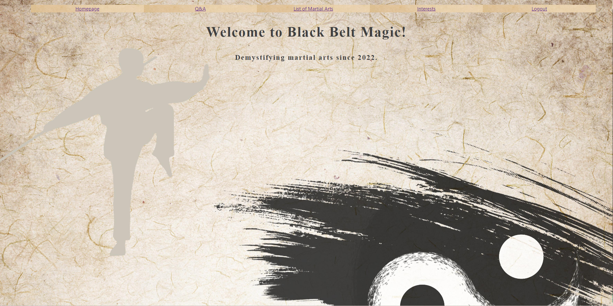

<h1 align="center">Hi 👋, I'm Ryan Allred</h1>
<h3 align="center">A passionate software developer who's always ready to take it to the next level.</h3>

  
  
  
  

<h1 align="center">Projects</h1>
<table bordercolor="#66b2b2">
  
   <tr>
    <td width="50%" valign="top">
      <h3 align="center">That's My Song</h3>
         
        
         
        

          
    
  
      

        
<strong>React.js, C#, .NET, & SQLServer</strong> - That's My Song is an application that takes inspiration from whosample.com and introduces users to new music through the use of sampling in the hip hop genre.

    </td>
    <td width="50%" valign="top">
      <h3 align="center">Black Belt Magic"</h3>
         
      
         
        

          
  
  
      

        
<strong>React.js & JSON Server</strong> - Black Belt Magic is a Q&A forum that connects prospective martial arts students with active martial arts instructors. 

    </td>
  </tr>
  
</table>

<h3 align="left">Connect with me:</h3>

<h3 align="left">Languages and Tools:</h3>

           

